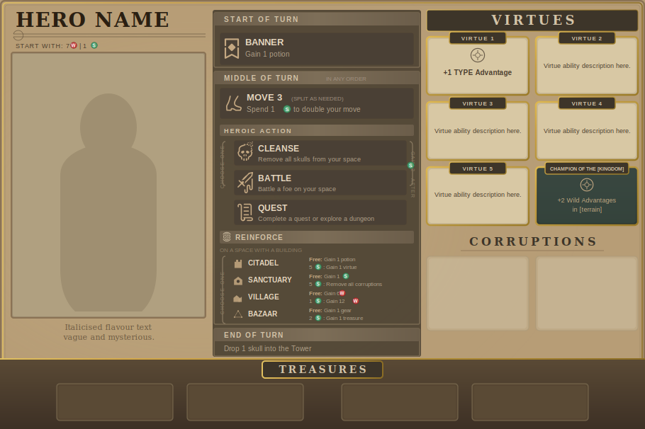

# RTDT Hero Card Creator

[](LICENSE)
[](https://chessmess.github.io/return-to-dark-tower-hero-creator/)

Create custom hero boards for [Return to Dark Tower](https://restorationgames.com/return-to-dark-tower/).

## Just want to use it?

**[Open the app in your browser](https://chessmess.github.io/return-to-dark-tower-hero-creator/)** — no installation required.

---



## Features

- **Live SVG Preview** — See your hero card update in real time as you edit
- **Vector PDF Export** — Download a print-ready PDF powered by jspdf + svg2pdf.js
- **Custom Portraits** — Upload any image with automatic clip-path framing
- **Full Virtue System** — Define up to 5 virtues with names, advantage types, and ability text
- **Champion Terrain** — Select terrain type for champion abilities
- **No Backend Required** — Runs entirely in the browser as a static site

## Requirements

- [Node.js](https://nodejs.org/) v20 or higher

## Install & Run

```bash
git clone https://github.com/ChessMess/return-to-dark-tower-hero-creator.git
cd return-to-dark-tower-hero-creator
npm install
npm run dev
```

Open **http://localhost:5173** in your browser.

## Build (standalone)

```bash
npm run build
```

The `dist/` folder is a self-contained static site. Host it anywhere, or serve it locally with:

```bash
npm run preview
```

## Usage

1. **Hero Identity** — Enter your hero's name and set starting Warriors and Spirit
2. **Portrait** — Upload a custom portrait image (JPG, PNG, etc.)
3. **Flavor Text** — Add two lines of atmospheric flavor text
4. **Virtues** — Define up to 5 virtues:
   - Virtue 1: choose a name and advantage type (e.g. "Stealth", "Magic", "Humanoid")
   - Virtues 2–5: add a name and two lines of ability text
5. **Champion** — Set the terrain type for your champion ability
6. Click **Download PDF** to save your hero board as a print-ready PDF

## Project Structure

```
src/
├── App.jsx            — Layout and state management
├── index.css          — Global styles
├── components/
│   ├── HeroCard.jsx   — Live SVG preview
│   └── HeroForm.jsx   — Editor form
└── data/
    └── defaultHero.js — Default hero values
```

## Contributing

Pull requests welcome! Please read [CONTRIBUTING.md](CONTRIBUTING.md) for development workflow, code standards, and the release process. Open an [issue](https://github.com/ChessMess/return-to-dark-tower-hero-creator/issues) first to discuss larger changes.

## License

[MIT](LICENSE) — see [LICENSE](LICENSE) for details.
