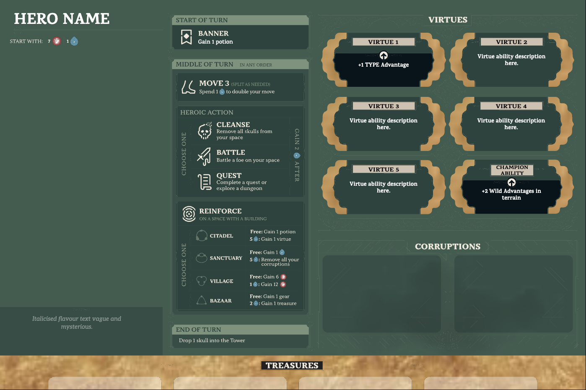

# RTDT Hero Board Creator

[](LICENSE)
[](https://chessmess.github.io/return-to-dark-tower-hero-creator/)

Create custom hero boards for [Return to Dark Tower](https://restorationgames.com/return-to-dark-tower/).

## Just want to use it?

**[Open the app in your browser](https://chessmess.github.io/return-to-dark-tower-hero-creator/)** — no installation required.

---



## Features

- **Live SVG Preview** — See your hero board update in real time as you edit
- **Vector PDF Export** — Download a print-ready PDF powered by jspdf + svg2pdf.js
- **Snapshot Export** — Click the camera icon to copy the board as a PNG to your clipboard; hold for 3 seconds to copy and download simultaneously
- **Custom Portraits** — Drag-and-drop or click-to-upload with automatic clip-path framing
- **Dynamic Virtue System** — 0–6 freely assignable virtue slots, each with a selectable type:
  - **Standard** — name and description text
  - **Advantage** — +1 type advantage
  - **Champion** — +2 wild advantages with kingdom selection
- **Banner Action** — Editable text for the hero's banner action
- **Flavor Text** — Single textarea with auto-wrapping and live character counter
- **Collapsible Editor** — Form sections collapse/expand with persistent state
- **No Backend Required** — Runs entirely in the browser as a static site

## Requirements

- [Node.js](https://nodejs.org/) v20 or higher

## Install & Run

```bash
git clone https://github.com/ChessMess/return-to-dark-tower-hero-creator.git
cd return-to-dark-tower-hero-creator
npm install
npm run dev
```

Open **http://localhost:5173** in your browser.

## Build (standalone)

```bash
npm run build
```

The `dist/` folder is a self-contained static site. Host it anywhere, or serve it locally with:

```bash
npm run preview
```

## Usage

1. **Hero Identity** — Enter your hero's name and set starting Warriors and Spirit
2. **Portrait** — Upload a custom portrait image (drag-and-drop or click to browse)
3. **Banner Action** — Set your hero's banner action text
4. **Flavor Text** — Add atmospheric flavor text (120 characters, auto-wraps on the board)
5. **Virtues** — Add up to 6 virtues and choose a type for each (Standard, Advantage, or Champion)
6. Click **Download PDF** to save your hero board as a print-ready PDF

## Project Structure

```
src/
├── main.jsx              — Mounts RouterApp
├── RouterApp.jsx          — BrowserRouter with / route
├── index.css              — Shared Tailwind entry
└── v2/                    — Hero board creator
    ├── App.jsx
    ├── components/
    │   ├── HeroBoard.jsx  — Live SVG preview
    │   └── HeroForm.jsx   — Editor form
    ├── data/
    │   └── defaultHero.js — Default hero values
    └── utils/
        └── heroIO.js      — Save/load/import/export
```

## Contributing

Pull requests welcome! Please read [CONTRIBUTING.md](CONTRIBUTING.md) for development workflow, code standards, and the release process. Open an [issue](https://github.com/ChessMess/return-to-dark-tower-hero-creator/issues) first to discuss larger changes.

## License

[MIT](LICENSE) — see [LICENSE](LICENSE) for details.
