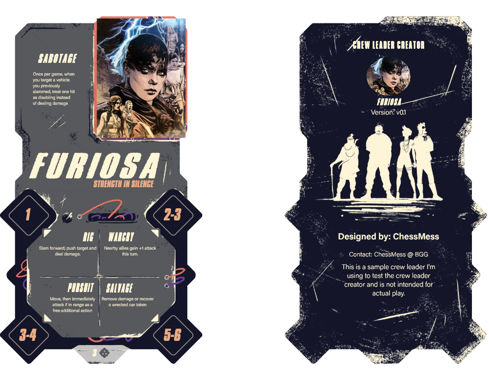

# Board Game Creator

[](LICENSE)
[](https://chessmess.github.io/board-game-creator/)

Create custom player boards for your favorite Restoration Games titles — starting with **Return to Dark Tower** and **Thunder Road: Vendetta**.

## Just want to use it?

**[Open the app in your browser](https://chessmess.github.io/board-game-creator/)** — no installation required.

---

## Games

### Return to Dark Tower — Hero Board Creator


- **Live SVG Preview** — See your hero board update in real time as you edit
- **Vector PDF Export** — Download a print-ready PDF powered by jspdf + svg2pdf.js
- **Snapshot Export** — Copy the board as a PNG to your clipboard; hold for 3 seconds to copy and download simultaneously
- **Custom Portraits** — Drag-and-drop or click-to-upload with automatic clip-path framing
- **Dynamic Virtue System** — 0–6 freely assignable virtue slots (Standard, Advantage, or Champion)
- **Banner Action** — Editable text for the hero's banner action
- **Flavor Text** — Single textarea with auto-wrapping and live character counter
- **Color Theming** — 6 preset themes matching official heroes, plus custom base-color and advanced individual color controls
- **Community Gallery** — Share your heroes with the community and browse others' creations

### Thunder Road: Vendetta — Crew Leader Creator



- **Live SVG Preview** — See your crew leader board update in real time as you edit
- **Vector PDF Export** — Download a print-ready PDF
- **Custom Portraits** — Drag-and-drop or click-to-upload
- **Crew Leader Stats** — Configure your leader's abilities and attributes
- **Community Gallery** — Share crew leaders and browse community creations

### Shared Features

- **Landing Page** — Split-screen game selector to choose your creator
- **Collapsible Editor** — Form sections collapse/expand with persistent state
- **Save / Load** — Save to JSON files with save-to-same-file support on Chrome/Edge
- **Recent Files** — Quick access to your last 5 saved/loaded files
- **No Backend Required** — Runs entirely in the browser as a static site (gallery uses Firebase free tier)

## Requirements

- [Node.js](https://nodejs.org/) v20 or higher

## Install & Run

```bash
git clone https://github.com/ChessMess/board-game-creator.git
cd board-game-creator
npm install
npm run dev
```

Open **http://localhost:5173** in your browser.

## Firebase Setup (Required For Gallery)

The gallery/auth features use Firebase. Configuration is loaded from Vite environment variables.
If these values are not provided, the app still builds and runs, but gallery/share/admin features are disabled.

1. Copy `.env.example` to `.env.local`
2. Fill in your Firebase values:

```bash
cp .env.example .env.local
```

```env
VITE_FIREBASE_API_KEY=...
VITE_FIREBASE_AUTH_DOMAIN=...
VITE_FIREBASE_DATABASE_URL=...
VITE_FIREBASE_PROJECT_ID=...
VITE_FIREBASE_STORAGE_BUCKET=...
VITE_FIREBASE_MESSAGING_SENDER_ID=...
VITE_FIREBASE_APP_ID=...
```

Security notes:

- Never commit real `.env` or `.env.local` files.
- Restrict your Firebase API key to expected referrers/APIs in Google Cloud.
- If a key is exposed, rotate it immediately in Google Cloud Console.

### GitHub Pages Deploy Secrets

If you deploy via `.github/workflows/deploy.yml`, add these repository secrets so gallery/auth works on the live site:

- `VITE_FIREBASE_API_KEY`
- `VITE_FIREBASE_AUTH_DOMAIN`
- `VITE_FIREBASE_DATABASE_URL`
- `VITE_FIREBASE_PROJECT_ID`
- `VITE_FIREBASE_STORAGE_BUCKET`
- `VITE_FIREBASE_MESSAGING_SENDER_ID`
- `VITE_FIREBASE_APP_ID`

## Build (standalone)

```bash
npm run build
```

The `dist/` folder is a self-contained static site. Host it anywhere, or serve it locally with:

```bash
npm run preview
```

## Project Structure

```
src/
├── main.jsx               — Mounts RouterApp
├── RouterApp.jsx           — BrowserRouter: / landing, /rtdt, /trv
├── LandingPage.jsx         — Split-screen game selector
├── index.css               — Shared Tailwind entry
├── shared/                 — Cross-game utilities
│   ├── components/
│   ├── hooks/
│   └── utils/
├── rtdt/                   — Return to Dark Tower hero board creator
│   ├── App.jsx
│   ├── components/
│   │   ├── HeroBoard.jsx
│   │   └── HeroForm.jsx
│   ├── data/
│   ├── hooks/
│   └── utils/
└── trv/                    — Thunder Road: Vendetta crew leader creator
    ├── App.jsx
    ├── components/
    │   ├── CrewLeaderBoard.jsx
    │   └── CrewLeaderForm.jsx
    ├── data/
    ├── hooks/
    └── utils/
```

## Contributing

Pull requests welcome! Please read [CONTRIBUTING.md](CONTRIBUTING.md) for development workflow, code standards, and the release process. Open an [issue](https://github.com/ChessMess/board-game-creator/issues) first to discuss larger changes.

## License

[MIT](LICENSE) — see [LICENSE](LICENSE) for details.
